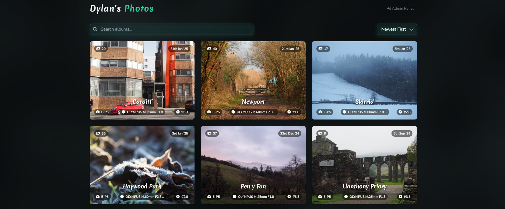
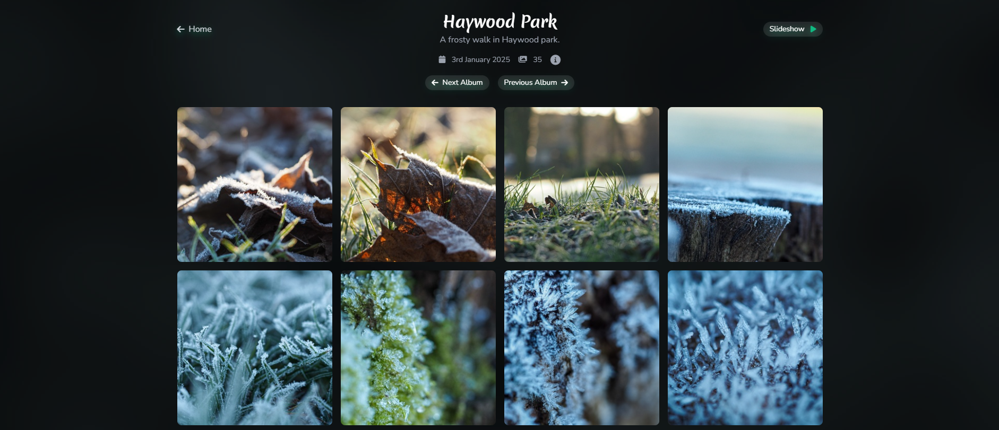

# Photo Gallery

Personal photo gallery web app built with Rust, HTMX, Alpine.js and Tailwind CSS. It has admin authentication and a admin panel to add, delete and edit albums with some storage stats. It currently has my name harded on a few pages, but should be easy to change.

Home page shows a list of album cards, and each album page contains a grid of the images. Images can also be viewed in slideshow mode which uses higher quality images.




## Table of Contents
1. [Current Limitations](#current-limitations)
2. [Setting Up Environment Variables](#setting-up-environment-variables)
3. [Generating a Hashed Password](#generating-a-hashed-password)
4. [Running the Application](#running-the-application)
5. [Tailwind CSS Setup](#tailwind-css-setup)
6. [Auto-Reloading in Development](#auto-reloading-in-development)

# Current Limitations
- Uploading through the admin panel is slow, although the image processing is very fast.
- Uploading too many images at once can cause a timeout (more > 100 images).
- One or two things could be made more mobile friendly.

## Setting Up Environment Variables

Create a `.env` file in the root of the project with the following variables:

```bash
# Database URL (SQLite)
DATABASE_URL=sqlite:photo_gallery.db

# JWT Secret (for authentication)
JWT_SECRET=jwt_secret

# Admin credentials (use src/bin/generate_password.rs to create an
# encryped password, otherwise the password check will fail to match the hashes)
ADMIN_USERNAME=admin
ADMIN_PASSWORD=$argon2id$v=19$m=19456,t=2,p=1$salt$hash

# Auto-reload mode for Minijinja (0 = off, 1 = normal, 2 = fast)
AUTO_RELOAD_MODE=2

# Application environment (development or production)
APP_ENV=development

# Host
HOST=127.0.0.1

# Port the app runs on
PORT=8080
```

**Notes:**
* Replace `jwt_secret` with a secure secret key for JWT encoding
* Replace `$argon2id$v=19$m=19456,t=2,p=1$salt$hash` with a hashed password generated using the `generate_password.rs` binary
* Set `APP_ENV` to `production` when deploying the application

## Generating a Hashed Password

The `generate_password.rs` binary is used to generate a hashed password for the admin user:

1. **Run the Binary**:
```bash
cargo run --bin generate_password
```

2. **Enter a Password**:
```
Enter your password: mysecurepassword
```

3. **Copy the Output**:
```
Hashed password: $argon2id$v=19$m=19456,t=2,p=1$salt$hash
```

4. **Update .env**: Replace the `ADMIN_PASSWORD` value in the `.env` file with the generated hash.

## Running the Application

### Development Mode

1. Set `APP_ENV=development` in the `.env` file
2. Start the application:
```bash
cargo run
```
3. The application will be available at `http://127.0.0.1:3000`

### Production Mode

1. Set `APP_ENV=production` in the `.env` file
2. Build the application:
```bash
cargo build --release
```
3. Run the application:
```bash
./target/release/photo-gallery
```

## Tailwind CSS Setup

Tailwind CSS is used for styling. In development, the Tailwind CDN is used for faster iteration. In production, you need to compile Tailwind CSS into a static file.

1. **Install Tailwind CSS**:
```bash
npm install tailwindcss postcss autoprefixer
```

2. **Generate Tailwind Config**:
```bash
npx tailwindcss init
```

3. **Create a Tailwind CSS Input File**:
Create a `src/tailwind.css` file with the following content:
```css
@tailwind base;
@tailwind components;
@tailwind utilities;
```

4. **Compile Tailwind CSS**:
```bash
npm run build
```

5. **Serve the Compiled CSS**: Ensure the compiled CSS file (`static/css/tailwind.css`) is served by the application.

## Auto-Reloading in Development

The application uses Minijinja's auto-reloading feature in development mode. This is controlled by the `AUTO_RELOAD_MODE` environment variable:

* `0`: Auto-reloading is disabled
* `1`: Normal auto-reloading
* `2`: Fast auto-reloading (watches template files for changes)

**Notes:**
* Auto-reloading only works in development mode (`APP_ENV=development`)
* Set `AUTO_RELOAD_MODE=2` for the best development experience

## Troubleshooting

* **Tailwind CSS Not Working in Production**: Ensure you've compiled Tailwind CSS and set `APP_ENV=production`
* **Auto-Reloading Not Working**: Ensure `AUTO_RELOAD_MODE` is set to `2` and `APP_ENV=development`
* **turbojpeg Fails to Build**: Ensure that you have CMake installed
* **Database Errors**: Use `sqlx db create` and `sqlx migrate run` to create a database and run the migrations on it